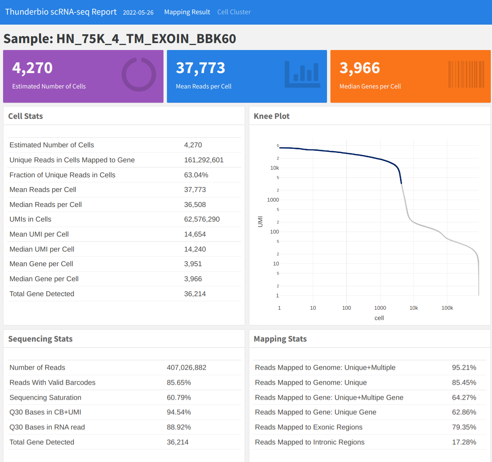
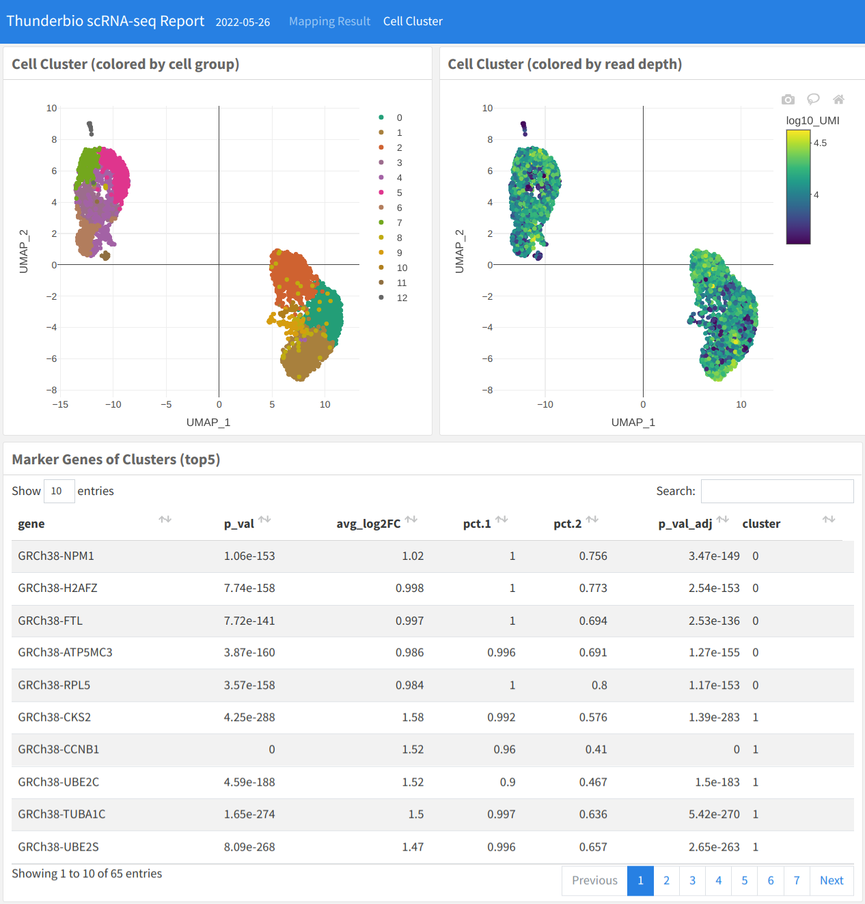
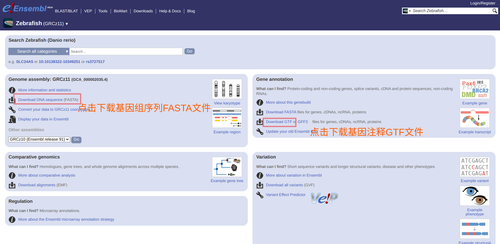

# StarScope

## Introduction

StarScope 是达普生物（thunderbio）自主开发的，其基于[STARsolo ](https://github.com/alexdobin/STAR/blob/master/docs/STARsolo.md)和 [Seurat](https://satijalab.org/seurat/) 的 [nextflow ](https://www.nextflow.io/) pipeline， 提供一站式的单细胞RNA-seq分析方案，可完成从原始的reads到细胞基因表达矩阵输出，并生成一个完整的HTML格式数据报告，表达结果还可接入多种下游分析。

- `starscope run` 启动3‘-RNA-seq pipeline，包括使用 cutadapt 对原始 reads 进行过滤和质控，利用 STARsolo 将过滤后的 reads map 回 reference genome，自动完成 barcode 和 UMI 序列的识别和纠正，并根据 mapping 结果生成 feature-barcode 矩阵。根据表达矩阵，Starcope会调用Seurat进行初步的细胞分群聚类，并返回每个群的marker gene。
- `starscope mkref` 协助用户构建定制化的 reference index。用户的研究样本可能并非常规的人类或者小鼠样本，例如基因编辑后的样本或者是非模式物种，这时可以利用 StarScope mkref 创建定制化的reference index再进行单细胞 RNAseq 分析。

## Features

### 结果清晰

StarScope 的报告包括多种结果参数，不仅展示细胞数量，细胞中的平均 reads 数量等关键结果，同时也输出饱和度，mapping rate，barcode reads 和 cDNA reads Q30 统计等信息，协助用户评估 library 本身的质量。另外还会输出初始的细胞分群结果以及各群中的差异表达基因，并将原始的表达矩阵保存为 HDF5 格式（h5Seurat）便于分享。





### 输入简单

Starcope 的输入格式非常简单，用户仅需要提供一个包含 sampleID 和 FASTQ 文件路径的 CSV 文件，白名单文件和构建好的STAR reference index文件就可直接运行。sample list 文件示例如下（fastq_1 是barcode read，fastq_2是cDNA read）：

```
sample,fastq_1,fastq_2
sampleID,read1.fq.gz,/absolute/path/to/read2.fq.gz
```

ThudnerBio scRNA-seq 的白名单文件位于`starscope/whitelist/V2_barcode_seq_210407_concat.txt.gz`，**需要先解压再使用**。

StarScope软件能够构建一个和 10x cellRanger 类似的 reference index，对于人或者小鼠样本的分析，可以使用 starscope 中自带的脚本 prepare_10x_compatible_reference.sh 进行构建。如果分析其他物种，仅需准备此物种的参考基因组序列文件（FASTA）和对应的基因注释文件（GTF）就可以直接使用 mkref 命令生成 index。

使用 `mkref` 构建 Zebrafish reference index，需要先访问 Ensembl 网站的 Zebrafish 主页下载 FASTA 和 GTF文件：



- 下载基因组序列 FASTA 文件（http://ftp.ensembl.org/pub/release-107/fasta/danio_rerio/dna/Danio_rerio.GRCz11.dna.primary_assembly.fa.gz）
- 下载基因注释 GTF 文件（http://ftp.ensembl.org/pub/release-107/gtf/danio_rerio/Danio_rerio.GRCz11.107.gtf.gz）
- 运行 starscope 命令如下，示例中 reference文件夹命名为**Danio_rerio.GRCz11.107_STAR**

```bash
gunzip Danio_rerio.GRCz11.dna.primary_assembly.fa.gz Danio_rerio.GRCz11.107.gtf.gz
starscope mkref --docker \
                --genomeFasta Danio_rerio.GRCz11.dna.primary_assembly.fa \
                --gtf Danio_rerio.GRCz11.107.gtf \
                --refoutDir Danio_rerio.GRCz11.107_STAR
```

### Reproducibility （高可重复性）

StarScope 支持 conda 和 docker 运行环境，保证了数据分析的高重复性。ThunderBio 提供已经配置好的 docker image 供用户使用，无需用户额外配置，也无需担心软件版本兼容性问题。

### Scalability

StarScope 基于 nextflow，支持多种运行环境，并可直接接入HPC的作业调度系统。用户可以直接使用 `--executor slurm` 参数将任务提交给系统的 slurm 作业调度系统，同时也兼容 sge，pbs 等。支持完全容器化运行，并可轻松部署到云端 kubernetes。

## Geting Start

### 安装依赖

#### Java（openJDK）

Ubuntu 20.04 LTS 中使用系统自带的APT软件包管理器安装：

```bash
sudo apt install default-jre
```

或者直接从[官网](https://jdk.java.net/18/)下载 (java 18)：

```bash
## download link may vary depending on java version
wget -c https://download.java.net/java/GA/jdk17.0.2/dfd4a8d0985749f896bed50d7138ee7f/8/GPL/openjdk-17.0.2_linux-x64_bin.tar.gz
tar xvzf openjdk-17.0.2_linux-x64_bin.tar.gz
## set environment variable
export JAVA_HOME="$(pwd)/jdk-17.0.2"
export PATH="$(pwd)/jdk-17.0.2/bin:$PATH"
## it is suggested to add export cmd above to your .bashrc
```
确认安装完成：

```bash
java --version
```

#### Nextflow

下载nextflow执行文件：

```bash
curl -s https://get.nextflow.io | bash
```

然后用户可将其移动到执行文件的默认路径下（例如: `~/.local/bin`）

```
mv ./nextflow ~/.local/bin/
```

验证nextflow正常运行

```
NXF_VER=22.04.5 nextflow run hello
```

如果nextflow和java安装正常，输出为：

```
N E X T F L O W  ~  version 22.04.0
Launching `https://github.com/nextflow-io/hello` [distraught_ride] DSL2 - revision: 4eab81bd42 [master]
executor >  local (4)
[92/5fbfca] process > sayHello (4) [100%] 4 of 4 ✔
Bonjour world!

Hello world!

Ciao world!

Hola world!
```

#### 运行环境 （Docker和conda）

StarScope兼容使用Docker或者conda作为运行环境，用户可以根据自己的机器部署灵活选择。

Docker可使用官方提供的安装脚本

```bash
curl -fsSL https://get.docker.com -o get-docker.sh
sh get-docker.sh
```

然后将当前用户加入到docker group中，请将所有需要使用docker的用户都加入到此group中

```bash
sudo usermod -aG docker $(whoami)
```

conda也可使用官方的安装脚本

```bash
wget https://repo.anaconda.com/miniconda/Miniconda3-latest-Linux-x86_64.sh
bash Miniconda3-latest-Linux-x86_64.sh
```

#### StarScope 执行文件

在安装完上述依赖后，StarScope包解压缩后可以将执行脚本`starscope`的软链接放入执行文件的默认目录（例如：`~/.local/bin`），方便直接调用：

```bash
tar xvzf StarScope-v1.0.0.release.tgz
ln -s starscope/starscope ~/.local/bin/
```

###  StarScope 运行

StarScope包括三个主要的命令：`run` ，`mkref` 和 `check_versions`，直接使用 `starscope -h` 可以直接查看关于命令使用和sample list的简短介绍， 使用`starscope run -h` 可以查看到`run`命令的完整选项列表，`mkref` 命令见上述 Zebrafish 的示例。**第一次运行时程序会自动创建 conda environment （调用 `--conda` 选项）或者 pull docker image （调用 `--docker` 选项），请保持网络连接**。用户也可以选择手动创建 conda env 或者 pull docker image。

conda:

```
conda env create -f starscope/scRNA-seq/scRNAseq_env.yml
```
docker:
```
docker pull registry-intl.cn-hangzhou.aliyuncs.com/thunderbio/thunderbio_scrnaseq_env:2.7.10a
```

#### starscope run

整个分析流程可以使用`starscope run` 启动，默认 nextflow 会输出进度信息，如果使用`-bg` 选项则程序会转入后台运行，**请注意`--mem` 选项的特殊格式**。

```
starscope run --docker \
              --input sampleList.csv \
              --genomeDir /path/to/STAR/reference/dir \
              --genomeGTF /path/to/genomeGTF \
              --whitelist /path/to/whitelist_file \
              --cpus 8 \
              --mem 32.GB \
              -bg
```

pipeline 运行中的信息如下：


### 结果文件

运行结束后会生成两个主要的文件夹 `results` 和 `work`， 前者包括所有的结果文件，后者则包括运行中的临时文件，确认结果没问题后可以直接删除。主要的输出结果包括

- HTML 报告 ： `results/report/HN-15K-V20-GR2_report.html`

- 细胞基因表达矩阵 (h5seurat 格式)： `results/report/HN-15K-V20-GR2.raw.h5seurat`

- 细胞基因表达矩阵：`results/starsolo/filtered/`