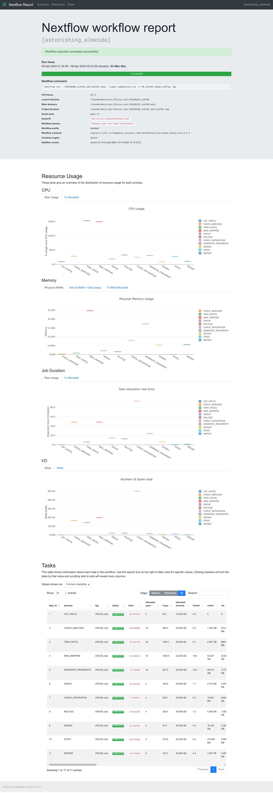

By default, each run of the pipeline will generate 
three tracing files in `results/pipeline_info/`, check
[nextflow document](https://www.nextflow.io/docs/stable/tracing.html) for details.

- execution\_trace\_\<timeStamp\>.txt
- execution\_timeline\_\<timeStamp\>.html
- execution\_report\_\<timeStamp\>.html

## Trace Report

Nextflow generates an execution tracing tsv file with 
valuable details on each process, including submission time, 
start time, completion time, CPU usage, 
and memory consumption.

The content of the trace report will be like:

```
task_id	hash	native_id	name	status	exit	submit	duration	realtime	%cpu	peak_rss	peak_vmem	rchar	wchar
1	02/3370e5	2820	CAT_FASTQ (ATAC05_test)	COMPLETED	0	2024-04-09 01:34:57.788	4.7s	3ms	94.1%	0	0	90.5 KB	208 B
2	ad/83d089	2821	CHECK_BARCODE (ATAC05_test)	COMPLETED	0	2024-04-09 01:35:02.520	48m 31s	48m 25s	284.3%	280 MB	1.5 GB	164.6 GB	164.2 GB
3	94/66efd8	2822	TRIM_FASTQ (ATAC05_test)	COMPLETED	0	2024-04-09 02:23:33.118	5m 55s	5m 49s	1530.7%	799.8 MB	3.4 GB	141 GB	139.5 GB
4	7a/cb0bc7	2823	BWA_MAPPING (ATAC05_test)	COMPLETED	0	2024-04-09 02:29:28.124	48m 30s	48m 29s	1492.5%	24.7 GB	54.6 GB	198.4 GB	172.4 GB
6	b1/9ce1a2	2824	DEDUP (ATAC05_test)	COMPLETED	0	2024-04-09 03:17:58.183	14m 45s	14m 39s	190.6%	2.1 GB	2.4 GB	21.6 GB	11 GB
8	19/4eca53	2827	MULTIQC (ATAC05_test)	COMPLETED	0	2024-04-09 03:32:43.215	12m 50s	12m 31s	326.5%	1.6 GB	5.4 GB	22.2 GB	23.4 MB
7	f7/98d61e	2826	CHECK_SATURATION (ATAC05_test)	COMPLETED	0	2024-04-09 03:17:58.200	1h 33m 30s	1h 33m 26s	248.1%	8 GB	18.1 GB	498.8 GB	344.1 GB
5	72/fd29b0	2825	GENERATE_FRAGMENTS (ATAC05_test)	COMPLETED	0	2024-04-09 03:17:58.193	1h 57m 30s	24m 2s	307.0%	17.3 GB	51.3 GB	17.4 GB	6.8 GB
9	6a/d6df90	2828	SIGNAC (ATAC05_test)	COMPLETED	0	2024-04-09 05:15:28.385	6m 15s	6m 11s	91.6%	5.3 GB	16.2 GB	9.1 GB	2.1 GB
10	6a/c6c563	2829	STATS (ATAC05_test)	COMPLETED	0	2024-04-09 05:21:43.412	34.9s	32.5s	270.9%	8.6 MB	374.9 MB	13.2 GB	2.1 GB
11	4b/13dee8	2830	REPORT (ATAC05_test)	COMPLETED	0	2024-04-09 05:22:18.374	1m 20s	1m 18s	103.7%	5.5 GB	1 TB	329 MB	78.5 MB
```

## Timeline Report

Nextflow can also create an HTML timeline report for all pipeline processes. 
See example below:


Each bar represents a single process run, the length of the bar represents
the duration time (wall-time). Colored part of the bar indicates real
processing time, grey part represents scheduling wait time.

## Execution report

The execution report is more concise, which logs running information in
the summary section, summarizes task resource usage 
using [plotly.js](https://plot.ly/javascript/) and collects task metrics like
trace report with more terms in a table.


